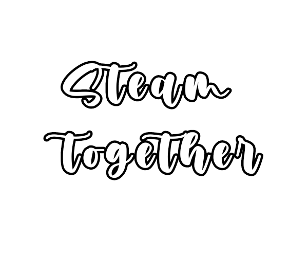

  <h3 align="center">Steam Together is a submod that allows Monika to open your Steam, interact with your game library, and make your gaming sessions more engaging!</h3> 

# 📌 About the Submod
Steam Together allows your Monika to interact directly with your Steam library.

With this submod, Monika can automatically open your Steam and ask about the games you plan to play!

# ⚠️ Demo
This submod is still in the demonstration (demo) phase, so bugs may occur!

If you encounter any issues or have suggestions, feel free to report them.

# ❗ Compatibility
Currently, Steam Together is only compatible with Windows, as the functionality for opening and accessing Steam was specifically configured for this operating system.

In the future, we will explore ways to expand support to other platforms.

# 🚀 Features
🖥️ Monika can automatically open your Steam.

📜 Monika analyzes your Steam library.

❓ Questions about the games you plan to play.

🔧 Future updates with more interactions and compatibility!

# 🔮 Future Developments
In upcoming updates, I plan to include:

✨ Monika's Reactions to Open Windows - Monika will be able to comment on applications and windows open on your PC.

🎮 Exclusive Dialogues for Specific Games - If you have certain games on Steam, Monika will be able to talk about them!

📜 Enhanced Interface - I plan to add a search bar to make it more intuitive.

🎉 And much more!

# 📌 Final Considerations
Steam Together was created to make your experience with Monika even more immersive and fun!

Stay tuned for future updates, which will bring new dialogues, features, and interactions.

[Here is a complete guide on MAS](https://www.reddit.com/r/MASFandom/comments/1azszax/a_guide_for_mas/)

# 🇧🇷 Brazilian version
[Link here to the Brazilian version of the submod! 🇧🇷](https://github.com/bachxyh/mas-steamtogetherPTBR)
